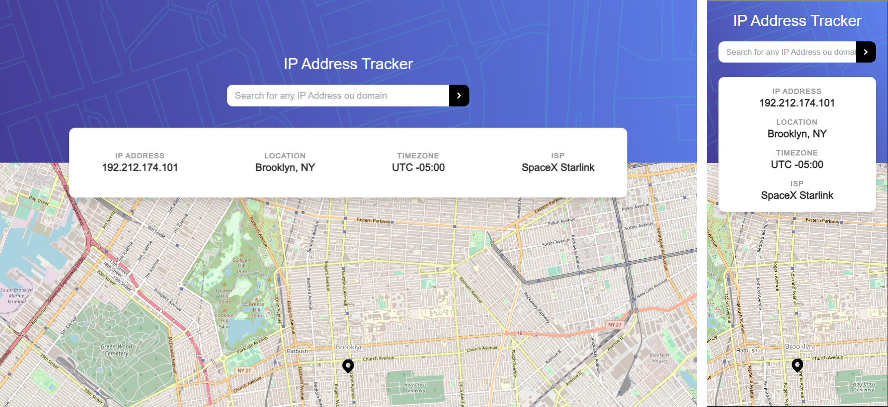

# Frontend Mentor - IP address tracker

This is a solution to the [IP Address Tracker app challenge on Frontend Mentor](https://www.frontendmentor.io/challenges/ip-address-tracker-I8-0yYAH0). Frontend Mentor challenges help you improve your coding skills by building realistic projects.

### Built with

- [Next.js](https://nextjs.org/)
- [TailwindCSS](https://tailwindcss.com/)

## Author

- Website - [Gabriel Rodrigues](https://ogabrielrodrigues.vercel.app/)
- Frontend Mentor - [@ogabrielrodrigues](https://www.frontendmentor.io/profile/ogabrielrodrigues)
